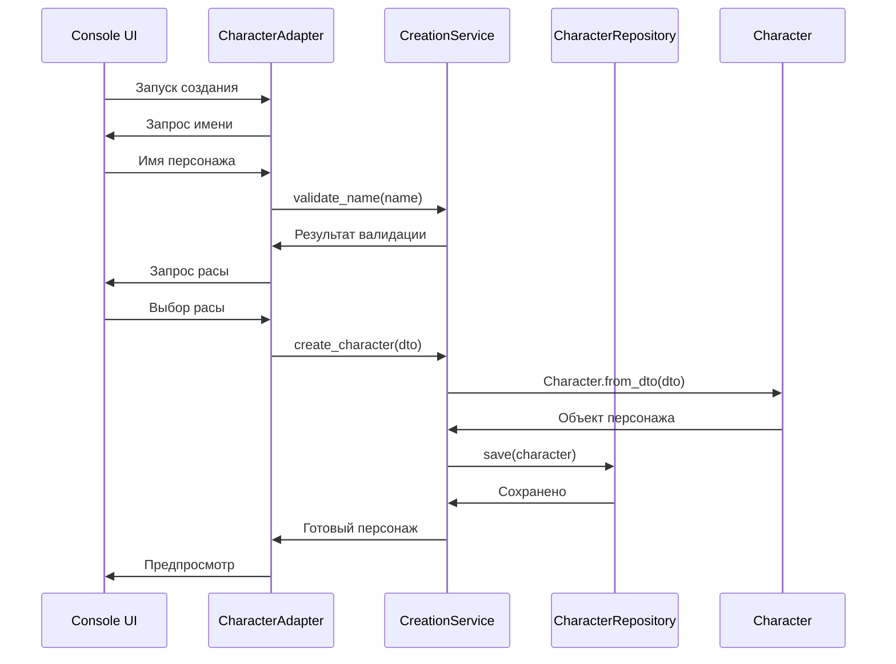
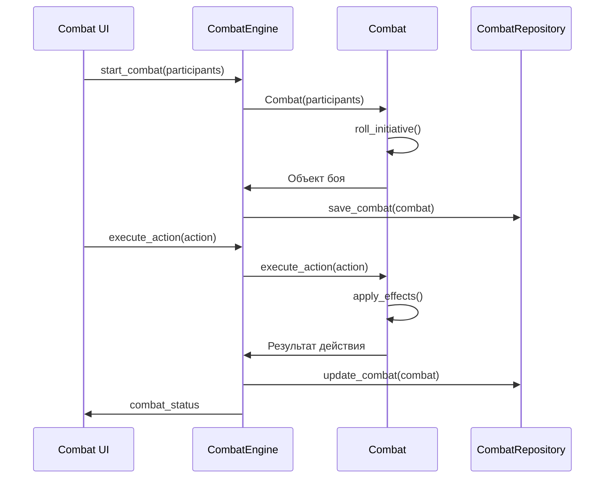

# API документация

## 🔌 Интерфейсы и сервисы D&D Text MUD

Техническая документация по API, интерфейсам и интеграции модулей.

---

## 📋 Содержание

- [Интерфейсы репозиториев](#репозитории)
- [Сервисы](#сервисы)
- [Консольные адаптеры](#консольные-адаптеры)
- [DTO модели](#dto-модели)
- [Интеграция с модами](#интеграция-с-модами)

---

## 🗄️ Репозитории

### CharacterRepository
```python
from abc import ABC, abstractmethod
from src.entities.character import Character

class CharacterRepository(ABC):
    """Интерфейс репозитория персонажей"""
    
    @abstractmethod
    def save(self, character: Character) -> None:
        """Сохранить персонажа"""
        pass
    
    @abstractmethod
    def load(self, character_id: str) -> Character:
        """Загрузить персонажа"""
        pass
    
    @abstractmethod
    def delete(self, character_id: str) -> None:
        """Удалить персонажа"""
        pass
    
    @abstractmethod
    def list_all(self) -> list[Character]:
        """Получить список всех персонажей"""
        pass
```

### RaceRepository
```python
from src.entities.race import Race

class RaceRepository(ABC):
    """Интерфейс репозитория рас"""
    
    @abstractmethod
    def get_all_races(self) -> list[Race]:
        """Получить все расы"""
        pass
    
    @abstractmethod
    def get_race(self, race_id: str) -> Race:
        """Получить расу по ID"""
        pass
    
    @abstractmethod
    def get_subraces(self, race_id: str) -> list[Race]:
        """Получить подрасы"""
        pass
```

---

## 🛠️ Сервисы

### CharacterCreationService
```python
from src.dtos.character_dto import CharacterDTO
from src.entities.character import Character

class CharacterCreationService:
    """Сервис создания персонажей"""
    
    def __init__(
        self,
        race_repository: RaceRepository,
        class_repository: ClassRepository,
        character_repository: CharacterRepository
    ):
        self._race_repo = race_repository
        self._class_repo = class_repository
        self._char_repo = character_repository
    
    def create_character(self, dto: CharacterDTO) -> Character:
        """Создать персонажа из DTO"""
        # Валидация данных
        self._validate_dto(dto)
        
        # Создание сущности
        character = Character.from_dto(dto)
        
        # Применение расовых бонусов
        self._apply_racial_bonuses(character)
        
        # Расчет производных характеристик
        self._calculate_derived_stats(character)
        
        return character
    
    def _validate_dto(self, dto: CharacterDTO) -> None:
        """Валидация DTO"""
        if not dto.name or len(dto.name) > 20:
            raise ValueError("Invalid character name")
        
        if dto.race_id not in self._race_repo.get_all_race_ids():
            raise ValueError("Invalid race")
    
    def _apply_racial_bonuses(self, character: Character) -> None:
        """Применить расовые бонусы"""
        race = self._race_repo.get_race(character.race_id)
        character.apply_racial_bonuses(race)
```

### CombatEngine
```python
from src.entities.character import Character
from src.entities.combat import Combat, CombatAction

class CombatEngine:
    """Движок боя"""
    
    def __init__(self):
        self._active_combats: dict[str, Combat] = {}
    
    def start_combat(self, participants: list[Character]) -> Combat:
        """Начать бой"""
        combat = Combat(participants)
        combat.roll_initiative()
        self._active_combats[combat.id] = combat
        return combat
    
    def execute_action(self, combat_id: str, action: CombatAction) -> None:
        """Выполнить действие в бою"""
        combat = self._active_combats.get(combat_id)
        if not combat:
            raise ValueError("Combat not found")
        
        combat.execute_action(action)
        
        if combat.is_finished():
            del self._active_combats[combat_id]
    
    def get_combat_status(self, combat_id: str) -> dict:
        """Получить статус боя"""
        combat = self._active_combats.get(combat_id)
        if not combat:
            return {}
        
        return {
            "id": combat.id,
            "turn_order": combat.get_turn_order(),
            "current_turn": combat.current_turn,
            "participants": combat.get_participants_status()
        }
```

---

## 🖥️ Консольные адаптеры

### CharacterCreationAdapter
```python
from src.use_cases.character_creation import CharacterCreationService
from src.console.ui_renderer import UIRenderer

class CharacterCreationAdapter:
    """Адаптер создания персонажа в консоли"""
    
    def __init__(
        self,
        creation_service: CharacterCreationService,
        ui_renderer: UIRenderer
    ):
        self._service = creation_service
        self._ui = ui_renderer
        self._current_dto = CharacterDTO()
    
    def run_creation_process(self) -> Character:
        """Запустить процесс создания персонажа"""
        self._ui.show_welcome()
        
        # Шаг 1: Имя
        self._current_dto.name = self._get_name()
        
        # Шаг 2: Раса
        self._current_dto.race_id = self._get_race()
        
        # Шаг 3: Характеристики
        self._current_dto.abilities = self._get_abilities()
        
        # ... остальные шаги
        
        # Создание персонажа
        character = self._service.create_character(self._current_dto)
        
        # Предпросмотр и сохранение
        self._show_character_preview(character)
        if self._confirm_save():
            return character
        
        return self.run_creation_process()
    
    def _get_name(self) -> str:
        """Получить имя персонажа"""
        while True:
            name = self._ui.get_input("Введите имя персонажа: ")
            
            if self._service.validate_name(name):
                return name
            
            self._ui.show_error("Неверное имя. Попробуйте еще раз.")
    
    def _get_race(self) -> str:
        """Получить выбор расы"""
        races = self._service.get_available_races()
        return self._ui.show_selection("Выберите расу:", races)
```

### MainMenuAdapter
```python
class MainMenuAdapter:
    """Адаптер главного меню"""
    
    def __init__(self, ui_renderer: UIRenderer):
        self._ui = ui_renderer
        self._menu_options = {
            "1": ("Новая игра", self._start_new_game),
            "2": ("Создать персонажа", self._create_character),
            "3": ("Загрузить игру", self._load_game),
            "4": ("Настройки", self._show_settings),
            "5": ("Моды", self._show_mods),
            "6": ("Выход", self._exit_game)
        }
    
    def show_menu(self) -> None:
        """Показать главное меню"""
        while True:
            self._ui.clear_screen()
            self._ui.show_title("D&D Text MUD")
            self._ui.show_menu_options(self._menu_options)
            
            choice = self._ui.get_input("Ваш выбор: ")
            
            if choice in self._menu_options:
                action = self._menu_options[choice][1]
                result = action()
                
                if result == "exit":
                    break
            else:
                self._ui.show_error("Неверный выбор")
    
    def _create_character(self) -> str:
        """Создание персонажа"""
        adapter = CharacterCreationAdapter(...)
        character = adapter.run_creation_process()
        self._ui.show_message(f"Персонаж {character.name} создан!")
        return "continue"
```

---

## 📦 DTO модели

### CharacterDTO
```python
from dataclasses import dataclass
from typing import Optional

@dataclass
class CharacterDTO:
    """DTO для создания персонажа"""
    name: str
    race_id: str
    class_id: str
    background_id: str
    abilities: dict[str, int]
    skills: list[str]
    languages: list[str]
    equipment: list[str]
    
    # Опциональные поля
    age: Optional[int] = None
    alignment: Optional[str] = None
    appearance: Optional[str] = None
    personality: Optional[str] = None
    
    def to_dict(self) -> dict:
        """Конвертировать в словарь"""
        return {
            "name": self.name,
            "race_id": self.race_id,
            "class_id": self.class_id,
            "background_id": self.background_id,
            "abilities": self.abilities,
            "skills": self.skills,
            "languages": self.languages,
            "equipment": self.equipment,
            "age": self.age,
            "alignment": self.alignment,
            "appearance": self.appearance,
            "personality": self.personality
        }
    
    @classmethod
    def from_dict(cls, data: dict) -> "CharacterDTO":
        """Создать из словаря"""
        return cls(**data)
```

### CombatActionDTO
```python
@dataclass
class CombatActionDTO:
    """DTO для боевого действия"""
    action_type: str  # "attack", "cast", "defend", "flee"
    actor_id: str
    target_id: Optional[str] = None
    parameters: Optional[dict] = None
    
    def validate(self) -> bool:
        """Валидация действия"""
        if not self.action_type or not self.actor_id:
            return False
        
        if self.action_type in ["attack", "cast"] and not self.target_id:
            return False
        
        return True
```

---

## 🔧 Интеграция с модами

### ModLoader
```python
from src.interfaces.mod_interface import ModInterface

class ModLoader:
    """Загрузчик модов"""
    
    def __init__(self, mod_directory: str):
        self._mod_directory = mod_directory
        self._loaded_mods: dict[str, ModInterface] = {}
    
    def load_all_mods(self) -> None:
        """Загрузить все моды"""
        mod_dirs = self._discover_mod_directories()
        
        for mod_dir in mod_dirs:
            try:
                mod = self._load_mod(mod_dir)
                self._loaded_mods[mod.name] = mod
            except Exception as e:
                logging.error(f"Failed to load mod {mod_dir}: {e}")
    
    def _load_mod(self, mod_dir: str) -> ModInterface:
        """Загрузить отдельный мод"""
        mod_config = self._load_mod_config(mod_dir)
        
        # Проверка зависимостей
        self._check_dependencies(mod_config)
        
        # Создание интерфейса мода
        mod = ModInterface(mod_dir, mod_config)
        
        return mod
    
    def get_mod_content(self, content_type: str) -> dict:
        """Получить контент из всех модов"""
        result = {}
        
        for mod in self._loaded_mods.values():
            if content_type in mod.content_types:
                mod_content = mod.get_content(content_type)
                self._merge_content(result, mod_content)
        
        return result
```

### ModInterface
```python
class ModInterface:
    """Интерфейс для взаимодействия с модом"""
    
    def __init__(self, mod_dir: str, config: dict):
        self.mod_dir = mod_dir
        self.config = config
        self.name = config["name"]
        self.version = config["version"]
        self.content_types = config.get("content_types", [])
    
    def get_content(self, content_type: str) -> dict:
        """Получить контент мода"""
        content_file = os.path.join(self.mod_dir, f"{content_type}.yaml")
        
        if not os.path.exists(content_file):
            return {}
        
        with open(content_file, 'r', encoding='utf-8') as f:
            return yaml.safe_load(f) or {}
    
    def get_races(self) -> dict:
        """Получить расы из мода"""
        return self.get_content("races").get("races", {})
    
    def get_classes(self) -> dict:
        """Получить классы из мода"""
        return self.get_content("classes").get("classes", {})
```

---

## 🔄 Поток данных

### Создание персонажа


### Боевая система


---

## 📝 Примеры использования

### Создание кастомного репозитория
```python
class JSONCharacterRepository(CharacterRepository):
    """JSON реализация репозитория персонажей"""
    
    def __init__(self, save_directory: str):
        self.save_directory = save_directory
    
    def save(self, character: Character) -> None:
        file_path = os.path.join(self.save_directory, f"{character.id}.json")
        
        with open(file_path, 'w', encoding='utf-8') as f:
            json.dump(character.to_dict(), f, ensure_ascii=False, indent=2)
    
    def load(self, character_id: str) -> Character:
        file_path = os.path.join(self.save_directory, f"{character_id}.json")
        
        with open(file_path, 'r', encoding='utf-8') as f:
            data = json.load(f)
        
        return Character.from_dict(data)
```

### Расширение сервиса
```python
class ExtendedCharacterCreationService(CharacterCreationService):
    """Расширенный сервис создания персонажей"""
    
    def create_character_with_validation(self, dto: CharacterDTO) -> Character:
        """Создание персонажа с расширенной валидацией"""
        # Базовая валидация
        self._validate_dto(dto)
        
        # Дополнительная валидация
        self._validate_extended_rules(dto)
        
        # Создание персонажа
        character = super().create_character(dto)
        
        # Дополнительная обработка
        self._apply_extended_features(character)
        
        return character
    
    def _validate_extended_rules(self, dto: CharacterDTO) -> None:
        """Расширенная валидация"""
        # Проверка совместимости расы и класса
        if not self._is_race_class_compatible(dto.race_id, dto.class_id):
            raise ValueError("Race and class are not compatible")
```

---

## 🧪 Тестирование API

### Unit тесты
```python
def test_character_creation_service():
    """Тест сервиса создания персонажа"""
    # Моки репозиториев
    race_repo = Mock()
    class_repo = Mock()
    char_repo = Mock()
    
    # Настройка моков
    race_repo.get_race.return_value = MockRace()
    
    # Создание сервиса
    service = CharacterCreationService(race_repo, class_repo, char_repo)
    
    # Тестирование
    dto = CharacterDTO(
        name="Test",
        race_id="human",
        class_id="fighter",
        # ... остальные поля
    )
    
    character = service.create_character(dto)
    
    assert character.name == "Test"
    assert character.race_id == "human"
    char_repo.save.assert_called_once()
```

### Интеграционные тесты
```python
def test_character_creation_flow():
    """Тест полного процесса создания персонажа"""
    # Настройка реальных репозиториев
    race_repo = YAMLRaceRepository("data/races.yaml")
    class_repo = YAMLClassRepository("data/classes.yaml")
    char_repo = JSONCharacterRepository("test_saves/")
    
    # Создание сервиса
    service = CharacterCreationService(race_repo, class_repo, char_repo)
    
    # Создание персонажа
    dto = CharacterDTO(...)
    character = service.create_character(dto)
    
    # Проверка сохранения
    loaded_character = char_repo.load(character.id)
    assert loaded_character.name == character.name
```

---

*API документация обновляется вместе с развитием проекта*