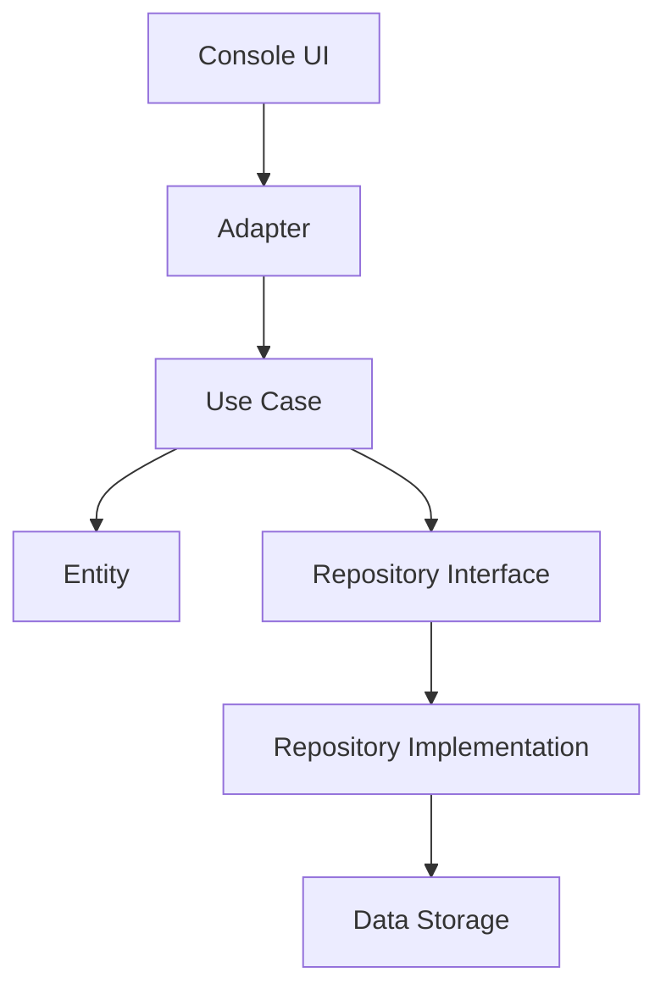

# Архитектура проекта

## 🏗️ Обзор

D&D Text MUD построен по принципам Clean Architecture с четким разделением ответственности и модульной структурой.

---

## 📁 Структура проекта

```
src/
├── entities/          # Бизнес-логика и сущности
├── use_cases/         # Прикладная логика
├── interfaces/        # Интерфейсы и абстракции
├── adapters/          # Реализация интерфейсов
├── dtos/              # Объекты передачи данных
└── console/           # Консольные адаптеры

data/                   # Игровые данные (YAML)
├── races.yaml
├── classes.yaml
├── abilities.yaml
└── ...

tests/                  # Тесты
├── unit/
├── integration/
└── e2e/
```

---

## 🎯 Принципы Clean Architecture

### The Dependency Rule
```text
Внешние слои зависят от внутренних,
внутренние слои не зависят от внешних
```

### Слои архитектуры

#### 1. Entities (Сущности)
- **Character** - персонаж игры
- **Race**, **Class** - игровые сущности
- **Ability**, **Skill** - характеристики
- **Equipment**, **Item** - предметы

#### 2. Use Cases (Сценарии использования)
- **CharacterCreationService** - создание персонажа
- **CombatEngine** - боевая система
- **AdventureEngine** - движок приключений

#### 3. Interfaces (Интерфейсы)
- **Repositories** - доступ к данным
- **Services** - внешние сервисы
- **UI Controllers** - управление интерфейсом

#### 4. Adapters (Адаптеры)
- **Repositories** - JSON/YAML хранилища
- **Console Adapters** - консольный UI
- **File System** - работа с файлами

---

## 🔧 Технический стек

### Ядро
- **Python 3.12+** - основной язык
- **Type Hints** - строгая типизация
- **Dataclasses** - модели данных

### Данные
- **PyYAML** - игровые данные
- **JSON** - сохранения
- **File System** - хранилище

### UI
- **Colorama** - цветной вывод
- **Rich** (опционально) - улучшенный UI

### Разработка
- **pytest** - тестирование
- **black** - форматирование
- **ruff** - линтинг
- **mypy** - type checking

---

## 📋 Паттерны проектирования

### Repository Pattern
```python
class CharacterRepository(ABC):
    @abstractmethod
    def save(self, character: Character) -> None: ...
    
    @abstractmethod
    def load(self, character_id: str) -> Character: ...
```

### Service Layer
```python
class CharacterCreationService:
    def create_character(self, data: CharacterDTO) -> Character:
        # Логика создания персонажа
        pass
```

### Adapter Pattern
```python
class ConsoleCharacterAdapter:
    def display_character(self, character: Character) -> None:
        # Консольный вывод
        pass
```

---

## 🔄 Поток данных



---

## 🎮 Игровые данные

### YAML структура
```yaml
# races.yaml
races:
  human:
    name: "Человек"
    ability_bonuses:
      strength: 1
      dexterity: 1
    # ...
```

### JSON сохранения
```json
{
  "character": {
    "name": "Арториус",
    "race": "human",
    "class": "fighter",
    "abilities": { ... }
  }
}
```

---

## 🧪 Тестирование

### Стратегия тестирования
- **Unit тесты** - изолированная логика
- **Integration тесты** - взаимодействие модулей
- **E2E тесты** - полный пользовательский сценарий

### Покрытие
- Цель: 90%+ покрытие кода
- Фокус на бизнес-логике
- Мокирование внешних зависимостей

---

## 📈 Масштабирование

### MUD преобразование
- Сетевые адаптеры
- Многопользовательские сущности
- База данных вместо файлов

### Производительность
- Ленивая загрузка данных
- Кэширование
- Асинхронные операции

---

## 🔒 Безопасность

### Валидация данных
- Pydantic модели
- Проверка входных данных
- Безопасная сериализация

### Файловая система
- Изолированные директории
- Проверка прав доступа
- Резервное копирование

---

*Документация обновляется вместе с развитием архитектуры*