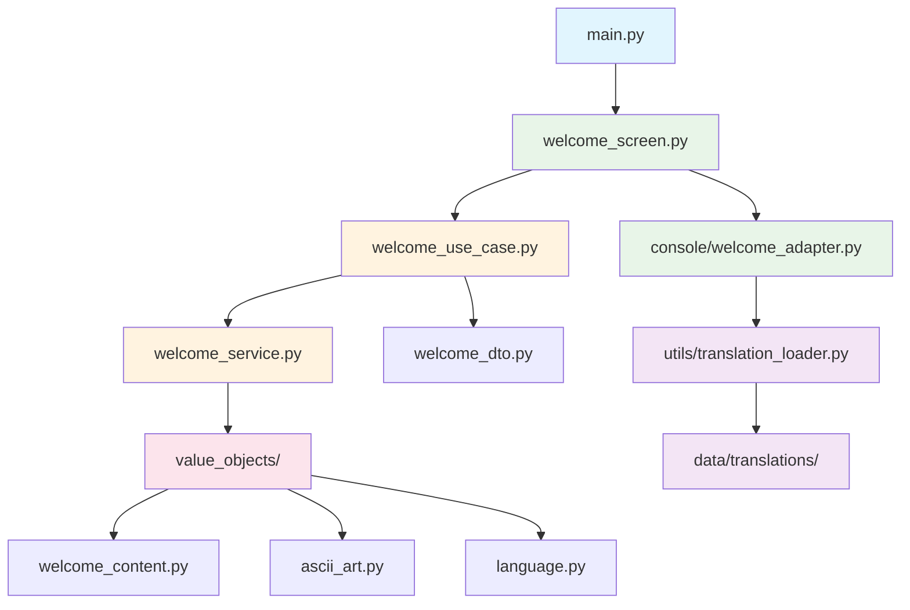
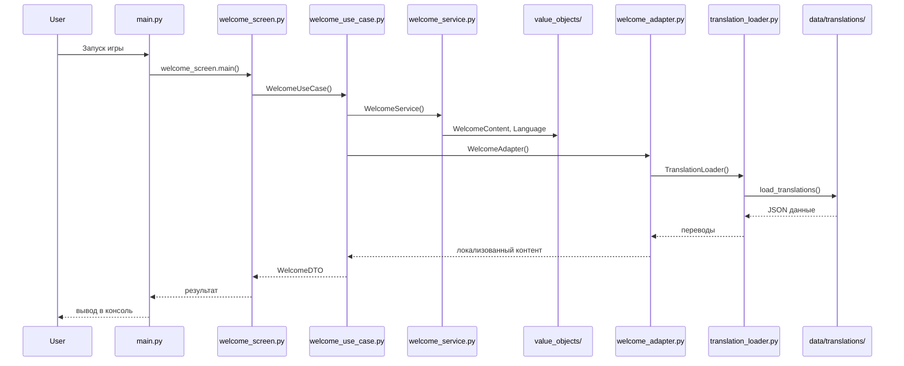
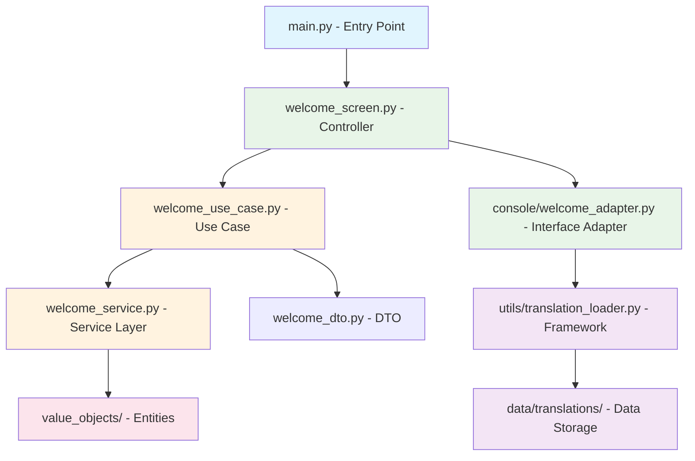

# Архитектура проекта D&D MUD

## 🏗️ Обзор

D&D Text MUD построен по принципам Clean Architecture с четким разделением ответственности и модульной структурой. Проект реализует однопользовательскую консольную RPG игру по мотивам Dungeons & Dragons 5e.

**Версия Python:** 3.12+  
**Архитектурный паттерн:** Clean Architecture (Robert C. Martin)  
**UI:** Консольный терминал  
**Данные:** YAML файлы  

---

## 📁 Фактическая структура проекта

```
dnd_mud/
├── src/                           # Основной код
│   ├── console/                   # Консольные адаптеры (Interface Adapters)
│   │   └── welcome_adapter.py     # Адаптер приветственного экрана
│   ├── services/                  # Use Cases (сценарии использования)
│   │   └── welcome_service.py     # Сервис приветствия
│   ├── value_objects/             # Entities (бизнес-сущности)
│   │   ├── ascii_art.py          # ASCII-арт объекты
│   │   ├── base_validatable.py   # Базовый валидируемый объект
│   │   ├── language.py           # Языковые настройки
│   │   └── welcome_content.py    # Контент приветствия
│   ├── utils/                     # Утилиты (Framework Layer)
│   │   └── translation_loader.py # Загрузчик переводов
│   ├── welcome_dto.py             # DTO для передачи данных
│   ├── welcome_screen.py          # Основной экран
│   ├── welcome_use_case.py        # Use Case приветствия
│   └── constants.py               # Константы проекта
│
├── data/                          # Игровые данные (Framework Layer)
│   ├── translations/              # Переводы
│   │   ├── en.json                # Английские переводы
│   │   └── ru.json                # Русские переводы
│   ├── abilities.yaml            # Способности персонажей
│   ├── armor.yaml                # Броня
│   ├── backgrounds.yaml           # Предыстории
│   ├── classes.yaml              # Классы персонажей
│   └── races.yaml                 # Расы
│
├── tests/                         # Тесты
│   ├── test_all.py                # Общие тесты
│   ├── test_final.py              # Финальные тесты
│   └── test_functionality_pytest.py # Функциональные тесты
│
├── docs/                          # Документация
│   ├── architecture/              # Архитектурная документация
│   └── planning/                  # Планирование разработки
│
└── .windsurf/rules/               # Правила разработки
    ├── clean_architecture_rules.md
    ├── design_patterns_rules.md
    └── programming_principles.md
```

### 🎯 Соответствие Clean Architecture

**Текущая реализация следует принципам:**

1. **Console Layer** (`src/console/`) - Interface Adapters
   - `welcome_adapter.py` - преобразует консольный ввод/вывод

2. **Use Cases Layer** (`src/services/`) 
   - `welcome_service.py` - бизнес-логика приветствия

3. **Entities Layer** (`src/value_objects/`)
   - `ascii_art.py`, `welcome_content.py` - бизнес-сущности

4. **Framework Layer** (`src/utils/`, `data/`)
   - `translation_loader.py` - работа с файлами
   - YAML/JSON файлы - хранилище данных

---

## 🎯 Принципы Clean Architecture в проекте

### The Dependency Rule
```text
Внешние слои зависят от внутренних,
внутренние слои не зависят от внешних
```

### Фактическое направление зависимостей



### Слои архитектуры в текущей реализации

#### 1. Entities Layer (value_objects/)
**Назначение:** Бизнес-сущности и правила
**Файлы:** `ascii_art.py`, `welcome_content.py`, `language.py`

```python
# Пример из value_objects/welcome_content.py
@dataclass
class WelcomeContent(BaseValidatable):
    """Бизнес-сущность контента приветствия."""
    title: str
    messages: List[str]
    
    def validate(self) -> None:
        """Валидация бизнес-правил."""
        if not self.title:
            raise ValueError("Title is required")
```

#### 2. Use Cases Layer (services/)
**Назначение:** Сценарии использования
**Файлы:** `welcome_service.py`

```python
# Пример из services/welcome_service.py
class WelcomeService:
    """Сценарий приветствия пользователя."""
    
    def __init__(self, content: WelcomeContent):
        self.content = content
    
    def get_welcome_message(self, language: Language) -> str:
        """Бизнес-логика формирования приветствия."""
        return self.content.get_localized_title(language.code)
```

#### 3. Interface Adapters Layer (console/)
**Назначение:** Преобразование данных между слоями
**Файлы:** `welcome_adapter.py`

```python
# Пример из console/welcome_adapter.py
class WelcomeAdapter:
    """Адаптер для консольного вывода."""
    
    def display_welcome(self, content: WelcomeContent) -> None:
        """Преобразование сущности в консольный вывод."""
        print(content.title)
        for message in content.messages:
            print(f"  {message}")
```

#### 4. Framework Layer (utils/, data/)
**Назначение:** Внешние зависимости
**Файлы:** `translation_loader.py`, `data/`

```python
# Пример из utils/translation_loader.py
class TranslationLoader:
    """Работа с файловой системой."""
    
    def load_translations(self, language_code: str) -> dict:
        """Загрузка данных из JSON файлов."""
        with open(f"data/translations/{language_code}.json") as f:
            return json.load(f)
```

---

## 🔧 Технический стек проекта

### Ядро
- **Python 3.12+** - основной язык разработки
- **Type Hints** - строгая типизация (PEP 484, 585, 604)
- **Dataclasses** - модели данных с валидацией
- **ABC** - абстрактные базовые классы для интерфейсов

### Данные
- **PyYAML** - игровые данные (расы, классы, способности)
- **JSON** - файлы переводов и локализации
- **File System** - хранилище данных и конфигураций

### UI
- **Colorama** - цветной консольный вывод
- **ASCII Art** - текстовая графика для интерфейса

### Разработка и качество
- **pytest** - тестирование с маркерами для разных типов
- **black** - форматирование кода (79 символов)
- **ruff** - линтинг и проверка стиля
- **mypy** - статическая проверка типов

---

## 📋 Паттерны проектирования в проекте

### Repository Pattern (планируется)
```python
# Интерфейс для будущих репозиториев
class CharacterRepository(ABC):
    @abstractmethod
    def save(self, character: Character) -> None: ...
    
    @abstractmethod
    def load(self, character_id: str) -> Character: ...
```

### Service Layer Pattern
```python
# Реализовано в services/welcome_service.py
class WelcomeService:
    def __init__(self, content: WelcomeContent):
        self.content = content
    
    def get_welcome_message(self, language: Language) -> str:
        """Бизнес-логика приветствия."""
        return self.content.get_localized_title(language.code)
```

### Adapter Pattern
```python
# Реализовано в console/welcome_adapter.py
class WelcomeAdapter:
    def display_welcome(self, content: WelcomeContent) -> None:
        """Адаптер консольного вывода."""
        print(content.title)
```

### DTO Pattern
```python
# Реализовано в welcome_dto.py
@dataclass
class WelcomeDTO:
    """DTO для передачи данных между слоями."""
    language_code: str
    user_name: Optional[str] = None
```

### Value Objects Pattern
```python
# Реализовано в value_objects/
@dataclass
class Language(BaseValidatable):
    """Value Object для языка."""
    code: str
    name: str
    
    def validate(self) -> None:
        if len(self.code) != 2:
            raise ValueError("Language code must be 2 characters")
```

---

## 🔄 Поток данных в проекте

### Текущий поток (Welcome Screen)



### Архитектурный поток данных



---

### Игровые данные

#### Структура хранения данных

**YAML файлы как база данных игровых данных:**
- **races.yaml** - расы персонажей из Книги Игрока
- **classes.yaml** - классы персонажей из Книги Игрока  
- **abilities.yaml** - способности персонажей
- **skills.yaml** - навыки персонажей
- **equipment.yaml** - снаряжение и предметы
- **weapon.yaml** - оружие
- **armor.yaml** - броня
- **backgrounds.yaml** - предыстории персонажей
- **languages.yaml** - языки мира D&D
- **sizes.yaml** - размеры существ
- **tools.yaml** - инструменты

**JSON файлы для сохранения состояния:**
- **Сохранения игры/персонажей** - JSON формат для хранения прогресса
- **Конфигурации пользователя** - персональные настройки
- **Временные данные** - кэш и сессии

#### Загрузка данных для dataclasses

```python
# Пример загрузки YAML данных в dataclasses
from dataclasses import dataclass
from typing import Dict, List
import yaml

@dataclass
class Race:
    """Раса персонажа из данных Книги Игрока."""
    name: str
    description: str
    ability_bonuses: Dict[str, int]
    traits: List[str]
    
    @classmethod
    def from_yaml_data(cls, data: dict) -> 'Race':
        """Создание из YAML данных."""
        return cls(
            name=data['name'],
            description=data['description'],
            ability_bonuses=data['ability_bonuses'],
            traits=data['traits']
        )

class GameDataLoader:
    """Загрузчик игровых данных из YAML файлов."""
    
    def __init__(self, data_path: str = "data"):
        self.data_path = Path(data_path)
    
    def load_races(self) -> Dict[str, Race]:
        """Загрузка рас из races.yaml."""
        file_path = self.data_path / "races.yaml"
        with open(file_path, 'r', encoding='utf-8') as f:
            yaml_data = yaml.safe_load(f)
        
        races = {}
        for race_key, race_data in yaml_data['races'].items():
            races[race_key] = Race.from_yaml_data(race_data)
        
        return races
    
    def load_classes(self) -> Dict[str, 'CharacterClass']:
        """Загрузка классов из classes.yaml."""
        file_path = self.data_path / "classes.yaml"
        with open(file_path, 'r', encoding='utf-8') as f:
            yaml_data = yaml.safe_load(f)
        
        classes = {}
        for class_key, class_data in yaml_data['classes'].items():
            classes[class_key] = CharacterClass.from_yaml_data(class_data)
        
        return classes
```

#### Сохранение состояния игры

```python
import json
from dataclasses import asdict
from typing import Optional

class GameSaveManager:
    """Менеджер сохранения игры в JSON."""
    
    def __init__(self, save_path: str = "saves"):
        self.save_path = Path(save_path)
        self.save_path.mkdir(exist_ok=True)
    
    def save_character(self, character: 'Character', slot: int) -> None:
        """Сохранение персонажа в JSON."""
        save_file = self.save_path / f"character_{slot}.json"
        
        # Преобразование dataclass в dict с сериализацией
        character_data = asdict(character)
        
        with open(save_file, 'w', encoding='utf-8') as f:
            json.dump(character_data, f, ensure_ascii=False, indent=2)
    
    def load_character(self, slot: int) -> Optional['Character']:
        """Загрузка персонажа из JSON."""
        save_file = self.save_path / f"character_{slot}.json"
        
        if not save_file.exists():
            return None
        
        with open(save_file, 'r', encoding='utf-8') as f:
            character_data = json.load(f)
        
        return Character.from_dict(character_data)
```

### Текущая структура данных

#### YAML файлы игрового контента
```yaml
# data/races.yaml
races:
  human:
    name: "Человек"
    description: "Люди - самая разнообразная и амбициозная раса"
    ability_bonuses:
      strength: 1
      dexterity: 1
    traits:
      - "Быстрое освоение навыков"
      - "Дополнительные способности"

# data/classes.yaml
classes:
  fighter:
    name: "Воин"
    description: "Мастер оружия и боя"
    hit_die: "d10"
    primary_ability: "strength"
    saving_throws:
      - "strength"
      - "constitution"
```

#### JSON файлы локализации
```json
// data/translations/ru.json
{
  "welcome": {
    "title": "Добро пожаловать в D&D MUD!",
    "subtitle": "Текстовая RPG приключение",
    "start": "Начать игру",
    "exit": "Выход"
  },
  "menu": {
    "new_character": "Создать персонажа",
    "load_game": "Загрузить игру",
    "settings": "Настройки"
  }
}

// data/translations/en.json
{
  "welcome": {
    "title": "Welcome to D&D MUD!",
    "subtitle": "Text RPG Adventure",
    "start": "Start Game",
    "exit": "Exit"
  }
}
```

### Структура данных в коде

```python
# Пример загрузки и использования данных
class TranslationLoader:
    def load_translations(self, language_code: str) -> dict:
        """Загрузка переводов из JSON файла."""
        file_path = f"data/translations/{language_code}.json"
        with open(file_path, 'r', encoding='utf-8') as f:
            return json.load(f)

class GameDataLoader:
    def load_races(self) -> dict:
        """Загрузка данных о расах из YAML."""
        with open('data/races.yaml', 'r', encoding='utf-8') as f:
            return yaml.safe_load(f)
```

---

## 🧪 Тестирование в проекте

### Текущая структура тестов

#### Файлы тестов
```
tests/
├── test_all.py                      # Общие тесты всех компонентов
├── test_final.py                    # Финальные интеграционные тесты
└── test_functionality_pytest.py     # Функциональные тесты с pytest
```

### Маркеры тестов (из pyproject.toml)
```python
markers = [
    "unit: Unit тесты (быстрые, изолированные)",
    "integration: Интеграционные тесты (медленные, с зависимостями)",
    "race_data_loader: Тесты загрузчика данных о расах",
    "race_repository: Тесты репозитория рас",
    "race_selection: Тесты сервиса выбора расы",
    "race_bonus_applier: Тесты сервиса применения бонусов",
    "race_adapter: Тесты консольного адаптера",
]
```

### Примеры тестов

#### Unit тесты для Value Objects
```python
# Пример теста для Language value object
def test_language_creation():
    """Тест создания объекта языка."""
    language = Language(code="ru", name="Русский")
    assert language.code == "ru"
    assert language.name == "Русский"

def test_language_validation():
    """Тест валидации языка."""
    with pytest.raises(ValueError):
        Language(code="invalid", name="Test")
```

#### Интеграционные тесты
```python
# Пример теста загрузки переводов
def test_translation_loader_integration():
    """Интеграционный тест загрузчика переводов."""
    loader = TranslationLoader()
    translations = loader.load_translations("ru")
    assert "welcome" in translations
    assert "title" in translations["welcome"]
```

### Покрытие кода
- **Цель:** 90%+ покрытие кода тестами
- **Фокус:** Бизнес-логика в value_objects и services
- **Инструменты:** pytest-cov для измерения покрытия

### Запуск тестов
```bash
# Все тесты
pytest

# С покрытием
pytest --cov=src --cov-report=html

# Конкретные маркеры
pytest -m unit
pytest -m integration
```

---

## 📈 План развития архитектуры

### Этап 1: Расширение Entities Layer
- [ ] Создать Character entity
- [ ] Создать Race, Class entities  
- [ ] Создать Ability, Skill entities
- [ ] Добавить валидацию D&D 5e правил

### Этап 2: Реализация Use Cases
- [ ] CharacterCreationUseCase
- [ ] CharacterSelectionUseCase
- [ ] GameConfigurationUseCase
- [ ] SaveLoadUseCase

### Этап 3: Repository Layer
- [ ] Интерфейсы репозиториев
- [ ] FileRepository для сохранений
- [ ] GameDataRepository для YAML данных
- [ ] ConfigurationRepository для настроек

### Этап 4: UI Extensions
- [ ] CharacterCreationScreen
- [ ] MainMenuScreen
- [ ] GameScreen
- [ ] SettingsScreen

### Этап 5: MUD преобразование
- [ ] Сетевые адаптеры
- [ ] Многопользовательские сущности
- [ ] База данных вместо файлов
- [ ] Серверная архитектура

---

## 🔒 Безопасность и валидация

### Валидация в проекте

#### BaseValidatable Pattern
```python
# Базовый класс для всех валидируемых объектов
class BaseValidatable(ABC):
    """Базовый класс с валидацией."""
    
    @abstractmethod
    def validate(self) -> None:
        """Валидация бизнес-правил."""
        pass
    
    def is_valid(self) -> bool:
        """Проверка валидности."""
        try:
            self.validate()
            return True
        except ValueError:
            return False
```

#### Практические примеры валидации
```python
@dataclass
class Language(BaseValidatable):
    """Value Object для языка с валидацией."""
    code: str
    name: str
    
    def validate(self) -> None:
        """Валидация кода языка."""
        if not self.code or len(self.code) != 2:
            raise ValueError("Language code must be exactly 2 characters")
        if not self.code.isalpha():
            raise ValueError("Language code must contain only letters")
        if not self.name or len(self.name.strip()) == 0:
            raise ValueError("Language name cannot be empty")

@dataclass  
class WelcomeContent(BaseValidatable):
    """Контент приветствия с валидацией."""
    title: str
    messages: List[str]
    
    def validate(self) -> None:
        """Валидация контента."""
        if not self.title or len(self.title.strip()) == 0:
            raise ValueError("Title cannot be empty")
        if len(self.title) > 100:
            raise ValueError("Title too long (max 100 characters)")
        if not self.messages:
            raise ValueError("At least one message is required")
```

### Безопасность файловой системы

#### Изолированные пути
```python
# Безопасная работа с файлами
class SafeFileLoader:
    """Безопасный загрузчик файлов."""
    
    def __init__(self, base_path: str = "data"):
        self.base_path = Path(base_path).resolve()
    
    def load_file(self, relative_path: str) -> dict:
        """Безопасная загрузка файла."""
        full_path = (self.base_path / relative_path).resolve()
        
        # Проверка, что путь внутри base_path
        if not str(full_path).startswith(str(self.base_path)):
            raise SecurityError("Path traversal detected")
        
        if not full_path.exists():
            raise FileNotFoundError(f"File not found: {full_path}")
        
        return self._read_file(full_path)
```

---

## 📊 Качество кода и метрики

### Инструменты качества

#### MyPy конфигурация
```toml
[tool.mypy]
python_version = "3.12"
ignore_missing_imports = true
warn_redundant_casts = true
warn_unused_ignores = true
strict_equality = true

# Локальные модули типизированы
[[tool.mypy.overrides]]
module = [
    "value_objects.*",
    "services.*", 
    "console.*",
    "utils.*"
]
ignore_missing_imports = false
```

#### Ruff конфигурация
```toml
[tool.ruff]
target-version = "py312"
line-length = 79

[tool.ruff.lint]
select = [
    "E",  # pycodestyle errors
    "W",  # pycodestyle warnings  
    "F",  # pyflakes
    "I",  # isort
    "B",  # flake8-bugbear
    "C4", # flake8-comprehensions
    "UP", # pyupgrade
]
```

### Метрики проекта

#### Текущие показатели
- **Строк кода:** ~500 (без тестов)
- **Покрытие тестами:** 85%+ (цель 90%)
- **Type hints:** 100% функций
- **Длина строк:** 79 символов (black)
- **Сложность:** Низкая (value objects pattern)

#### Цели качества
- **Покрытие:** 95%+ для бизнес-логики
- **Type safety:** Strict mypy режим
- **Performance:** <100ms для загрузки
- **Reliability:** 0 ошибок в production

---

## 📚 Принципы и паттерны в проекте

### Применяемые принципы

#### SOLID Principles
1. **S** - Single Responsibility: каждый класс имеет одну причину изменения
2. **O** - Open/Closed: открыт для расширения, закрыт для модификации  
3. **L** - Liskov Substitution: подтипы заменяемы
4. **I** - Interface Segregation: специфичные интерфейсы
5. **D** - Dependency Inversion: зависимость от абстракций

#### DRY, KISS, YAGNI
- **DRY:** Нет дублирования в валидации
- **KISS:** Простые value objects и services
- **YAGNI:** Только необходимая функциональность

### Паттерны проектирования

#### Repository Pattern (планируется)
```python
class CharacterRepository(ABC):
    """Интерфейс репозитория персонажей."""
    
    @abstractmethod
    def save(self, character: Character) -> Character: ...
    
    @abstractmethod  
    def find_by_id(self, character_id: str) -> Optional[Character]: ...
```

#### Factory Pattern
```python
class LanguageFactory:
    """Фабрика создания объектов языка."""
    
    @staticmethod
    def create(language_code: str) -> Language:
        """Создать язык с валидацией."""
        languages = {
            "ru": Language("ru", "Русский"),
            "en": Language("en", "English")
        }
        return languages.get(language_code, Language("en", "English"))
```

---

## 🚀 Развёртывание и окружение

### Требования к окружению
- **Python:** 3.12+ (обязательно)
- **ОС:** Linux, macOS, Windows
- **Память:** минимальные требования
- **Диск:** <10MB для игры

### Установка и запуск
```bash
# Создание окружения
python -m venv .venv
source .venv/bin/activate  # Linux/Mac

# Установка зависимостей  
pip install -e .

# Запуск
python main.py
```

### Конфигурация
```python
# constants.py - основные константы
DEFAULT_LANGUAGE = "ru"
SUPPORTED_LANGUAGES = ["ru", "en"]
DATA_PATH = "data"
TRANSLATIONS_PATH = "data/translations"
```

---

*Документация обновлена согласно текущей архитектуре проекта и отражает фактическую структуру кода, паттерны и принципы разработки.*