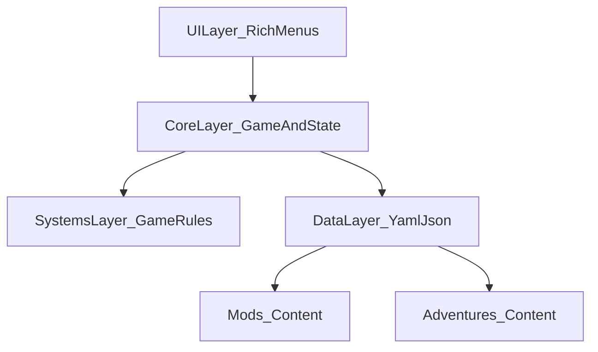
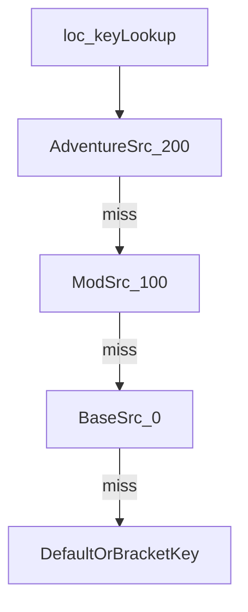

# План разработки и ключевые элементы DnD MUD (переписывание с 0)

Ниже — консолидированный план, основанный на документации: [docs/development/architecture.md](docs/development/architecture.md), [docs/development/plan.md](docs/development/plan.md), [docs/game/README.md](docs/game/README.md), [docs/game/mods.md](docs/game/mods.md), [docs/game/adventures.md](docs/game/adventures.md), [docs/game/localization.md](docs/game/localization.md), а также API-ориентирах из [docs/development/api.md](docs/development/api.md) и ограничениях UI из [docs/development/technical_window_manager.md](docs/development/technical_window_manager.md).

## Ключевые элементы игры (что обязательно должно быть в новой версии)

### Архитектура и слои

- **UI Layer**: меню/экраны, рендер через Rich, адаптивность под ширину/высоту терминала.
- **Core Layer**: `Game` (цикл, инициализация), `StateManager` (состояния), `WindowManager` (размер/перенос), координация.
- **Systems Layer**: игровые системы (персонаж, кубики, бой, магия, инвентарь, отдых, время и т.п.).
- **Data Layer**: YAML-конфиги и контент, JSON-сохранения, загрузчики модов/приключений.

### Состояния игры (StateManager)

Базовый набор из документации: `MAIN_MENU`, `CHARACTER_CREATION`, `ADVENTURE`, `COMBAT`, `INVENTORY`, `REST`, `SETTINGS`, `LOAD_GAME`, `EXIT` ([docs/development/api.md](docs/development/api.md)).

### Командный ввод (Command-паттерн)

- Единый парсер команд (например: `/help`, `/go`, `/take`, `/use`, `/attack`) с алиасами.
- Контекстная маршрутизация команд по текущему `GameState`.
- Валидация ввода и человекочитаемые ошибки.

### D&D 5e ядро механик (минимум для MVP)

- **Dice**: нотация (`2d6+3`, `1d20`), advantage/disadvantage, крит (естественные 20/1), подробный `DiceResult`.
- **Character**: STR/DEX/CON/INT/WIS/CHA, модификаторы, HP, уровень, класс/раса/предыстория.
- **CombatSystem**: инициатива, порядок ходов, action economy (action/bonus/reaction), атака vs AC, урон, conditions.
- **Inventory**: предметы/экипировка, вес/лимиты, расходники, золото.
- **MagicSystem** (после MVP или в расширенном MVP): spell slots, подготовка/каст, концентрация.
- **RestSystem/TimeSystem** (следующий слой): short/long rest, восстановление ресурсов; игровой календарь/время суток.

### Сохранения

- **JSON формат** с `metadata.version`, `timestamp`, `character`, `inventory`, `location`, `quests`, `game_time` и т.п. (пример в [docs/development/architecture.md](docs/development/architecture.md)).
- **Надёжность**: атомарная запись (tmp → rename), backup, проверка версии и целостности при загрузке ([docs/development/api.md](docs/development/api.md)).

### Локализация (обязательная часть системы контента)

Приоритет источников:

- **adventure**: priority 200
- **mod**: priority 100
- **base**: priority 0

Идея: adventure и mod могут **переопределять** базовые ключи.

### Моды и приключения (контент-пайплайн)

- **Каждый мод и каждое приключение обязаны иметь `localization.yaml**` ([docs/game/mods.md](docs/game/mods.md), [docs/game/adventures.md](docs/game/adventures.md), [docs/game/localization.md](docs/game/localization.md)).
- **Мод**: `mod.yaml` (метаданные, что добавляет/изменяет) + YAML контент (items/spells/mechanics/…) + (опционально) Python hooks.
- **Приключение**: `adventure.yaml` (метаданные, уровни, зависимости), `locations/`, `quests/`, `npcs/`, `events/`, опционально `mechanics/custom_rules.yaml`.

### Терминальный UI (WindowManager)

- **Минимальный размер**: 80x24.
- **Перенос текста**: параграфы, длинные слова, учёт рамок, отступы.
- **Деградация**: если терминал узкий — упрощённые заголовки вместо ASCII-арта.

## План разработки (roadmap для переписывания с 0)

Ниже — порядок, который снижает риск переделок: сначала инфраструктура/контракты и data-пайплайн, затем системы, затем UI/контент, затем качество.

### Фаза 0: Основание проекта (скелет)

- Зафиксировать структуру каталогов как в документации (src/core, src/ui, src/systems, src/data, src/utils; data/yaml, data/saves, data/mods, data/adventures).
- Поднять базовый запуск: `main.py`/точка входа, инициализация Rich Console.
- Подготовить минимальные конфиги `data/yaml/settings.yaml` и `data/yaml/localization.yaml`.

### Фаза 1: Core + UI каркас

- Реализовать (или перенести дизайн) `**WindowManager**` с `TerminalSize`, проверкой 80x24 и `wrap_text` (ориентир: [docs/development/technical_window_manager.md](docs/development/technical_window_manager.md)).
- Реализовать `**StateManager**` и перечисление `GameState` (ориентир: [docs/development/api.md](docs/development/api.md)).
- Реализовать `**MenuBase**` и `**MainMenu**` (адаптивная отрисовка, пункт “Continue” зависит от `can_continue`).
- Реализовать `**Renderer**` как фасад над Rich (панели, таблицы, форматирование).

### Фаза 2: Data layer (локализация, загрузчики, контракты контента)

- Реализовать `**LocalizationManager**` с приоритетами base/mod/adventure, кэшированием, форматированием строк.
- Реализовать загрузку YAML:
  - базовых файлов (`settings.yaml`, `localization.yaml`)
  - модов и приключений (по структурам из [docs/game/mods.md](docs/game/mods.md) и [docs/game/adventures.md](docs/game/adventures.md))
- Определить и зафиксировать схемы данных (минимально — через dataclasses/pydantic): `ModManifest`, `AdventureManifest`, `Location`, `Quest`, `Npc`, `Event`.

### Фаза 3: Создание персонажа (D&D 5e)

- Экран создания персонажа: имя, раса, класс, предыстория.
- Генерация статов: 4d6 drop lowest, стандартный массив, point-buy (как в [docs/development/plan.md](docs/development/plan.md)).
- Начальные навыки/языки/снаряжение.

### Фаза 4: Игровое ядро (MVP геймплей)

- **Dice**: парсинг нотации, преимущества/помеха, крит, история.
- **CombatSystem (MVP)**: инициатива, один бой, базовые действия, урон/HP.
- **Inventory (MVP)**: поднимать/использовать/экипировать базовые предметы.
- **Сохранения (MVP)**: save/load JSON, версионирование, атомарность, автосейв со слотами.

### Фаза 5: Мир/приключение (вертикальный срез)

- Поддержать запуск 1 “демо-приключения” из `data/adventures/...`:
  - 3–5 локаций
  - 1–2 квеста со стадиями
  - 2–3 NPC с диалогами
  - 1–2 события (skill_check/combat/social)
- Интеграция “особых правил” приключения через `mechanics/custom_rules.yaml`.

### Фаза 6: Расширение систем

- Магия (spell slots, концентрация), условия (conditions) и больше действий в бою.
- TimeSystem + RestSystem.
- Прокачка: XP, level up, ASI, feats (по приоритету из [docs/development/plan.md](docs/development/plan.md)).

### Фаза 7: Моды (полноценный контракт и совместимость)

- Валидатор `mod.yaml` (compatible_version, conflicts/load_before/load_after).
- Хуки (минимальный набор событий из [docs/game/mods.md](docs/game/mods.md)) и правила безопасности/изоляции.
- Документация “как сделать мод” (вынести из docs или обновить под новый код).

### Фаза 8: Качество, безопасность, релиз

- Тесты: unit/integration/e2e; критичные системы стремиться к 100%.
- Безопасность: безопасная загрузка YAML, валидация пользовательского ввода, защита сохранений.
- Сборка: cx_Freeze (если нужно) и кроссплатформенное тестирование Windows/Linux.

## Набор «Definition of Done» на каждую фазу

- **Рабочий сценарий** (пусть и короткий) от запуска до выхода.
- **Стабильность**: ошибки не “проглатываются” без сообщения, сохранения не портятся при сбое.
- **Тесты**: на новые критичные модули.
- **Документация**: обновлённые ключевые README/описания форматов.

